# Hello, I'm Franco Moises! 👋

I'm a final-year student at the Catholic University of Salta, Argentina. I've been programming since I was 15, and I am passionate about technology and software development. Currently, I'm solo developing a system for a connectivity and radiofrequency company. 

I am looking forward to new professional experiences that allow me to enrich my knowledge and put my skills into practice in real-world scenarios.

## 📚 My studies and career
I specialize in developing technological solutions, with a focus on creating software that solves real-world problems. Throughout my career, I've worked on projects that use multiple technologies and agile methodologies such as Scrum and Kanban. I also create complete business management systems, handling everything from backend development to frontend implementation.

## 💻 My skills and expertise

### Programming Languages:
-  Python
-  Java
-  C#
-  HTML
-  CSS
-  JavaScript
-  PHP

### Frameworks and Technologies:
-  React
-  Node.js
-  Next.js
-  MySQL
-  SQL Server
-  Firebase
-  MongoDB
-  PostgreSQL  

## 🚀 Current projects and work
I am currently developing a system individually for a connectivity and radiofrequency company, applying my skills in web development, databases, and object-oriented programming.

  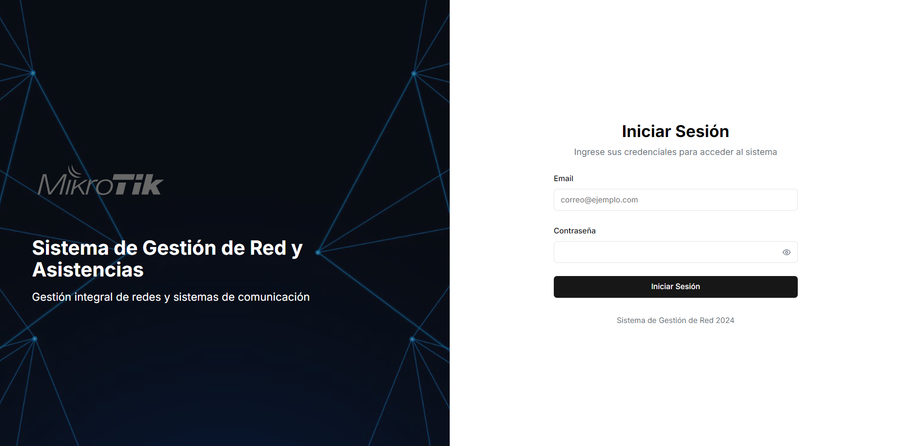
  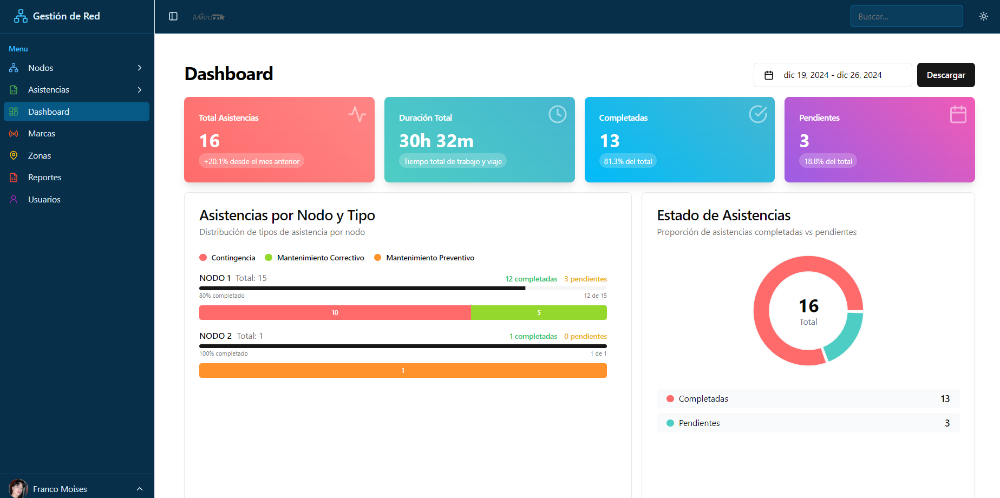
  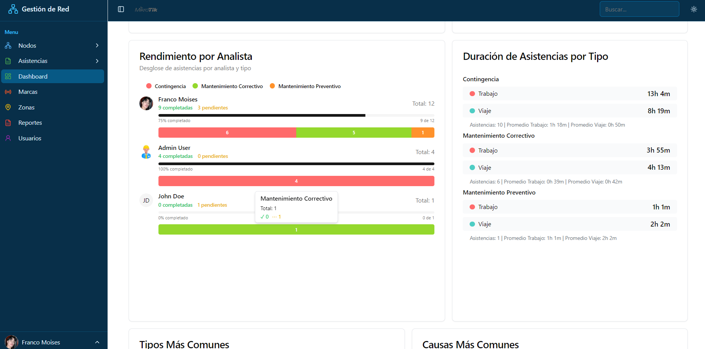
  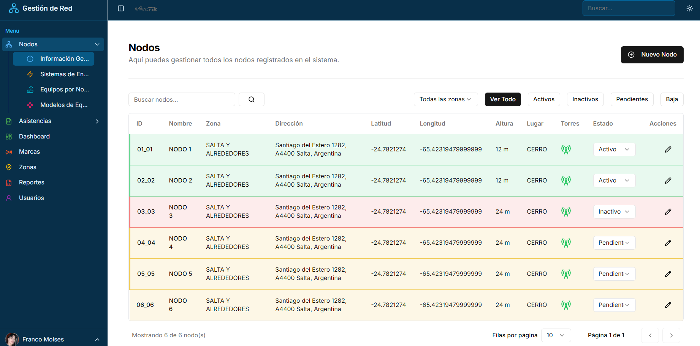
  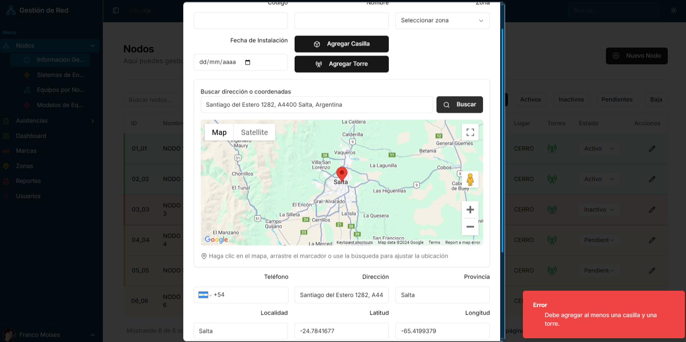
  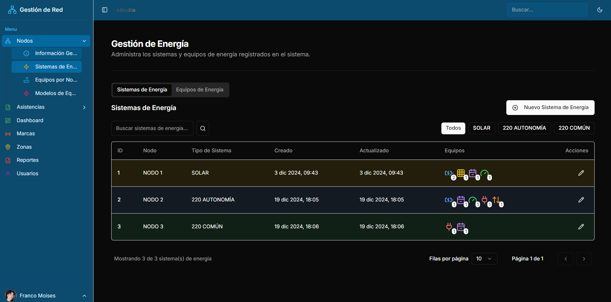
  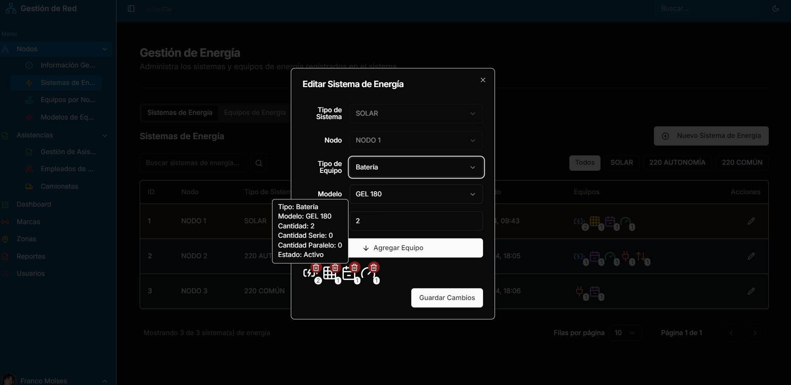
  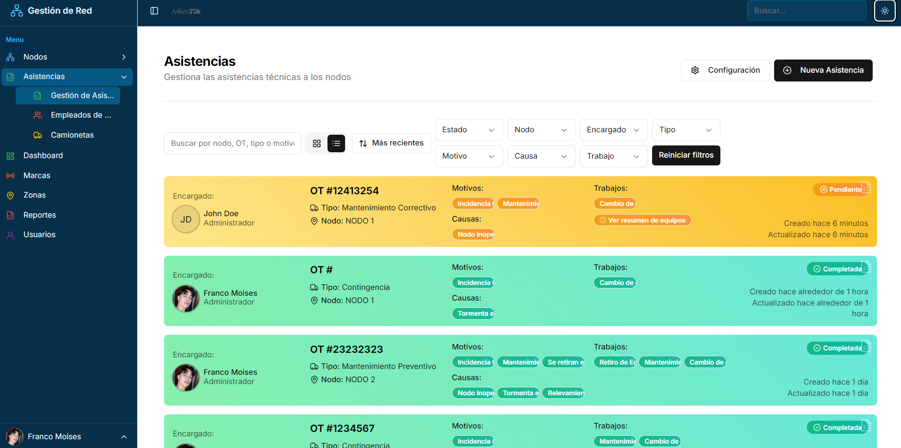
  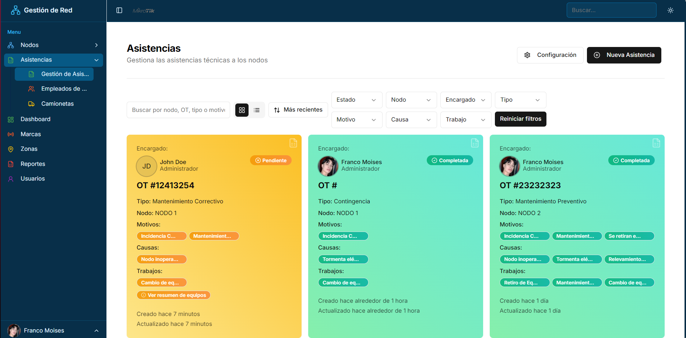
  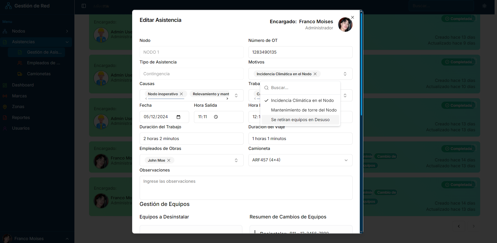
  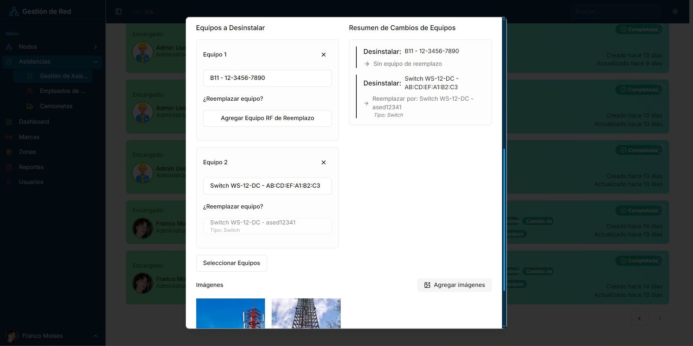
  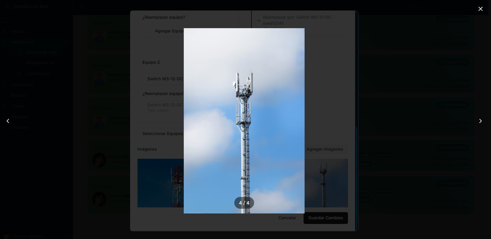

## 💬 Let's connect
If you'd like to collaborate or learn more about my projects, feel free to contact me or follow me on GitHub. I'm always eager to take on new challenges and expand my knowledge through new work experiences!

### My networks:
- [LinkedIn](https://www.linkedin.com/in/franco-julián-moisés-romero-717060279/)

---

